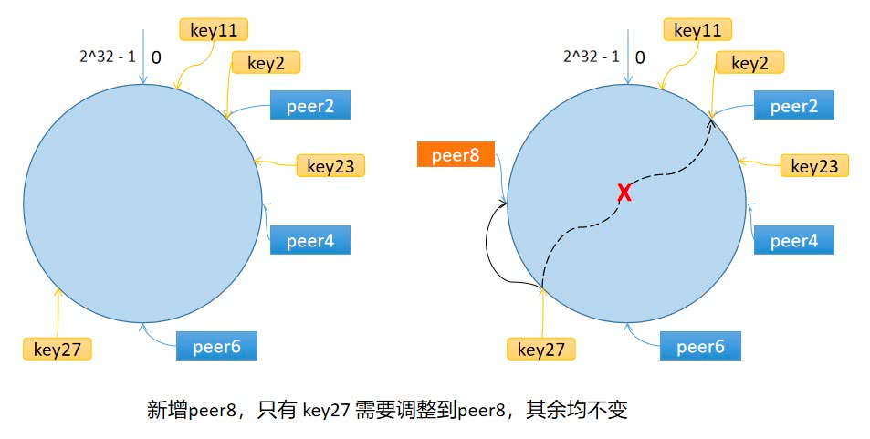

## 一致性哈希
> 前言：使用 `哈希取模` 算法时，当结点的数量增加或减少时，都会导致之前访问的结点都发生了变化。
> 如果是保存用户session的会话，就会导致登陆失效；如果是缓存的话，会导致大面积缓存失效而造成缓存雪崩。
> 为了解决 `哈希取模 `无法解决结点增加或减少带来的问题，这里使用 `一致性哈希` 算法

### 步骤
一致性哈希算法将 key 映射到 2^32 的空间中，将这个数字首尾相连，形成一个环。

* 计算节点/机器(通常使用节点的名称、编号和 IP 地址)的哈希值，放置在环上。
* 计算 key 的哈希值，放置在环上，顺时针寻找到的第一个节点，就是应选取的节点/机器。

环上有 peer2，peer4，peer6 三个节点，key11，key2，key27 均映射到 peer2，key23 映射到 peer4。此时，如果新增节点/机器 peer8，假设它新增位置如图所示，那么只有 key27 从 peer2 调整到 peer8，其余的映射均没有发生改变。

也就是说，一致性哈希算法，在新增/删除节点时，只需要重新定位该节点附近的一小部分数据，而不需要重新定位所有的节点，这就解决了上述的问题。

### 数据倾斜问题
如果服务器的节点过少，容易引起 key 的倾斜。例如上面例子中的 peer2，peer4，peer6 分布在环的上半部分，下半部分是空的。那么映射到环下半部分的 key 都会被分配给 peer2，key 过度向 peer2 倾斜，缓存节点间负载不均。

为了解决这个问题，引入了虚拟节点的概念，一个真实节点对应多个虚拟节点。

假设 1 个真实节点对应 3 个虚拟节点，那么 peer1 对应的虚拟节点是 peer1-1、 peer1-2、 peer1-3（通常以添加编号的方式实现），其余节点也以相同的方式操作。

* 第一步，计算虚拟节点的 Hash 值，放置在环上。
* 第二步，计算 key 的 Hash 值，在环上顺时针寻找到应选取的虚拟节点，例如是 peer2-1，那么就对应真实节点 peer2。

虚拟节点扩充了节点的数量，解决了节点较少的情况下数据容易倾斜的问题。而且代价非常小，只需要增加一个字典(map)维护真实节点与虚拟节点的映射关系即可。