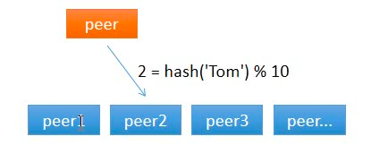

## 哈希取模

对于分布式缓存来说，当一个节点接收到请求，如果该节点并没有存储缓存值，那么它面临的难题是，从谁那获取数据？自己，还是节点1, 2, 3, 4… 。假设包括自己在内一共有 10 个节点，当一个节点接收到请求时，随机选择一个节点，由该节点从数据源获取数据。
假设第一次随机选取了节点 1 ，节点 1 从数据源获取到数据的同时缓存该数据；那第二次，只有 1/10 的可能性再次选择节点 1, 有 9/10 的概率选择了其他节点，如果选择了其他节点，就意味着需要再一次从数据源获取数据，一般来说，这个操作是很耗时的。这样做，一是缓存效率低，二是各个节点上存储着相同的数据，浪费了大量的存储空间。
那有什么办法，对于给定的 key，每一次都选择同一个节点呢？
`使用 hash 算法也能够做到这一点。那把 key 的每一个字符的 ASCII 码加起来，再除以 10 取余数可以吗？当然可以，这可以认为是自定义的 hash 算法。`

从上面的图可以看到，任意一个节点任意时刻请求查找键 Tom 对应的值，都会分配给节点 2，有效地解决了上述的问题。

`节点数量变化了怎么办？`

简单求取 Hash 值解决了缓存性能的问题，但是没有考虑节点数量变化的场景。假设，移除了其中一台节点，只剩下 9 个，那么之前 hash(key) % 10 变成了 hash(key) % 9，也就意味着几乎缓存值对应的节点都发生了改变。即几乎所有的缓存值都失效了。节点在接收到对应的请求时，均需要重新去数据源获取数据，容易引起 缓存雪崩。
> 缓存雪崩：缓存在同一时刻全部失效，造成瞬时DB请求量大、压力骤增，引起雪崩。常因为缓存服务器宕机，或缓存设置了相同的过期时间引起。

那如何解决这个问题呢？一致性哈希算法可以。参考一致性哈希算法